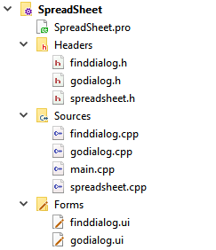
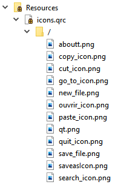

# Application Using Main Window


##  Create a MainWindow based application using the designer 

~~~~
based on everything we saw in the course, we are finally able to create our own main windows. But before moving to the practice part, reminding some concept that will be necessary in our homework.
~~~~
* **What's a main window ?**
   * its role ?
   * what does it contain ?
   * how can we design it ?
   * how does it works ?


# Introduction
The main window is the whole working area of the program, that provides a framework for building an application's user interface. The main way to access other windows, load and save files...etc.
This window contains a different components as menu bar , tool bar and others.

Qt has QMainWindow and its related classes for main window management. QMainWindow has its own layout to which you can add QToolBars, QDockWidgets, a QMenuBar, and a QStatusBar. The layout has a center area that can be occupied by any kind of widget
* QMenuBar : is a class that contains a list of pull-down menu items horizontally.
* QToolBar: is a class provides a movable panel which contains a set of controls.
* QStatusBar: is a class that provides a horizontal bar suitable for presenting status informations.


> **Let's code now**


# Spreadsheet
In this iteration of the SpreadSheet we must obtain an application with:

* Menu Bar
* Two tools bars
* Status bar to print the informations

and also we have to write a set of basic functionalities for a complete project.

## Remark
--> **We could just use Qt Designer, write some coding lines and we will get the result. But to really understand how everything works, we have to code it and analyze it.** 

--> **all explanations will be included in the code as comments** &nbsp;


## a general view of the project


> and for additional resources ->> for icons in our case<<-  
we must create a new QT resource file, then we can add all icons that we need

  
 
 

# finddialog.h 
* **QDialog** this class is the base class of dialog windows
```cpp
#include <QDialog>

namespace Ui {
class finddialog;
}

class finddialog : public QDialog
{
    Q_OBJECT

public:
    explicit finddialog(QWidget *parent = nullptr);
    ~finddialog();

    // to get the user text
     QString getText()const;

private:
    Ui::finddialog *ui;
}; 
```

# finddialog.cpp
``` cpp
#include "finddialog.h"
#include "ui_finddialog.h"
finddialog::finddialog(QWidget *parent) :
    QDialog(parent),
    ui(new Ui::finddialog)
{
    ui->setupUi(this);

}
QString finddialog::getText()const
{
    //as we said this function should return the text of the lineedit
    return ui->lineedit2->text();
}


finddialog::~finddialog()
{
    delete ui;
}
```


# finddialog.ui
**A simple interface with:** 
* a label 
* a lineedit 
* two pushbuttons
 


# godialog.h
```cpp
#include <QDialog>

namespace Ui {
class GoDialog;
}

class GoDialog : public QDialog
{
    Q_OBJECT

public:
    explicit GoDialog(QWidget *parent = nullptr);
    ~GoDialog();
 QString getText()const;
private:
    Ui::GoDialog *ui;
};
```


# godialog.cpp
* **QRegExp** this class provides pattern matching using regular expressions
* **QRegExpValidator** this class is used to check a string against a regular expression
```cpp
#include "godialog.h"
#include "ui_godialog.h"
#include<QRegExp>
#include<QRegExpValidator>
GoDialog::GoDialog(QWidget *parent) :
    QDialog(parent),
    ui(new Ui::GoDialog)
{
   ui->setupUi(this);
     // the text of lineedit should be acceptable
     QRegExp regCell{"[A-Z][1-9][0-9]{0,2}"};

     //Validating the regular expression
     ui->lineEdit->setValidator(new QRegExpValidator(regCell));
}
QString GoDialog::getText()const
{
    return ui->lineEdit->text();
}

GoDialog::~GoDialog()
{
  delete ui;
}
```


# godialog.ui
**A simple interface with:** 
* a label 
* a lineedit
* two pushbuttons
* horizontal spacer 


# spreadsheet.h
* **QMainWindow** class provides a main application window
* **QTableWidget** class provides an item-based table view with a default model
* **QAction** class provides an abstract user interface action that can be inserted into widgets
* **QMenu** class provides a menu widget for use in menu bars, context menus, and other popup menus
* **QToolBar** class provides a movable panel that contains a set of controls
* **QStatusBar** class provides a horizontal bar suitable for presenting status information

```cpp
#include <QMainWindow>
#include <QTableWidget>
#include <QAction>
#include <QMenu>
#include <QToolBar>
#include <QLabel>
#include <QStatusBar>

class SpreadSheet : public QMainWindow
{
    Q_OBJECT

public:
    SpreadSheet(QWidget *parent = nullptr);
    ~SpreadSheet();

protected:
    void setupMainWidget();
    void createActions();
    void createMenus();
    void createToolBars();
    void makeConnexions();

private slots:
    void close();
    void updateStatusBar(int, int); //Respond for the call changed
    // slot that answers to goCell 
    void goCellSlot();
    void saveslot();//slot to answer the save call
    //void saveasslot();
    void openfile(); // slot for openfile
    void findCell();  // slot for find
   

private:
void Save(QString filename);//method to save the content

void loadcontent(QString filename); //method to load the content of a file

 //Pointers
private:
    // --------------- Central Widget -------------//
    QTableWidget *spreadsheet;

    // --------------- Actions --------------//
    QAction * newFile;
    QAction * open;
    QAction * save;
    QAction * saveAs;
    QAction * exit;
    QAction *cut;
    QAction *copy;
    QAction *paste;
    QAction *deleteAction;
    QAction *find;
    QAction *row;
    QAction *Column;
    QAction *all;
    QAction *goCell;
    QAction *recalculate;
    QAction *sort;
    QAction *showGrid;
    QAction *auto_recalculate;
    QAction *about;
    QAction *aboutQt;


    // ---------- Menus ----------//
    QMenu *FileMenu;
    QMenu *editMenu;
    QMenu *toolsMenu;
    QMenu *optionsMenu;
    QMenu *helpMenu;


    //  ------ Widget pour la bare d'etat--------//
    QLabel *cellLocation;  //position of the active cell
    QLabel *cellFormula;   // Active cell formula

    //name of the current file
    QString * currentfile=nullptr;

};
```

# spreadsheet.cpp
* **QPixmap** class is an off-screen image representation that can be used as a paint device
* **QMessageBox** class provides a modal dialog for informing the user or for asking the user a question and receiving an answer
* **QFileDialog** class provides a dialog that allow users to select files or directories
```cpp
 
#include "spreadsheet.h"
#include <QPixmap>     
#include <QMenuBar> 
#include <QToolBar>   
#include <QApplication>
#include <QMessageBox>
#include<godialog.h>
#include<finddialog.h>
#include <QFileDialog> 
#include <QTextStream>

SpreadSheet::SpreadSheet(QWidget *parent)
    : QMainWindow(parent)
{
    //Seting the spreadsheet
    setupMainWidget();

    // Creating Actions
    createActions();

    // Creating Menus
    createMenus();


    //Creating the tool bar
    createToolBars();

    //making the connexions
    makeConnexions();

    //Creating the labels for the status bar (should be in its proper function)
    cellLocation = new QLabel("(1, 1)");
    cellFormula = new QLabel("");
    statusBar()->addPermanentWidget(cellLocation);
    statusBar()->addPermanentWidget(cellFormula);
    //initiate file name
    currentfile = nullptr;
    //put the name of the spreadsheet
    setWindowTitle("Buffer");
    // to set an icon for our window
    setWindowIcon(QIcon(":/spreadIcon.png"));
}

void SpreadSheet::setupMainWidget()
{
    spreadsheet = new QTableWidget;
    //the number of rows in the spreadsheet
    spreadsheet->setRowCount(100);
    //the number of columns in the spreadsheet
    spreadsheet->setColumnCount(10);
    //to set the spreadsheet in the center
    setCentralWidget(spreadsheet);

}
SpreadSheet::~SpreadSheet()
{
    delete spreadsheet;

    // --------------- Actions       --------------//
    delete  newFile;
    delete  open;
    delete  save;
    delete  saveAs;
    delete  exit;
    delete cut;
    delete copy;
    delete paste;
    delete deleteAction;
    delete find;
    delete row;
    delete Column;
    delete all;
    delete goCell;
    delete recalculate;
    delete sort;
    delete showGrid;
    delete auto_recalculate;
    delete about;
    delete aboutQt;
    // ---------- Menus ----------//
    delete FileMenu;
    delete editMenu;
    delete toolsMenu;
    delete optionsMenu;
    delete helpMenu;
}
void SpreadSheet::createActions()
{
     // --------- New File -------------------//
    //set an icon
   QPixmap newIcon(":/new_file.png");
   //create the action and add the icon created
   newFile = new QAction(newIcon, "&New", this);
   // for the shortcut
   newFile->setShortcut(tr("Ctrl+N"));
   // --------- open file -------------------//
    QPixmap openIcon(":/ouvrir_icon.png");
   open = new QAction(openIcon,"&Open", this);
   open->setShortcut(tr("Ctrl+O"));

    // --------- save file -------------------
   QPixmap saveIcon(":/save_file.png");
   save = new QAction(saveIcon,"&Save", this);
   save->setShortcut(tr("Ctrl+S"));

    // --------- save as  file -------------------//
   QPixmap saveasIcon(":/saveasIcon.png");
   saveAs = new QAction(saveasIcon,"save &As", this);

    // --------- Cut -------------------//
   QPixmap cutIcon(":/cut_icon.png");
   cut = new QAction(cutIcon, "Cu&t", this);
   cut->setShortcut(tr("Ctrl+X"));

   // --------- Copy -----------------//
   QPixmap copyIcon(":/copy_icon.png");
   copy = new QAction( copyIcon,"&Copy", this);
   copy->setShortcut(tr("Ctrl+C"));

    // --------- Paste -----------------//
   QPixmap pasteIcon(":/paste_icon.png");
   paste = new QAction(pasteIcon, "&Paste", this);
   paste->setShortcut(tr("Ctrl+V"));

   // --------- Delete -----------------//
   QPixmap deleteIcon(":/supprimer.png");
   deleteAction = new QAction( deleteIcon,"&Delete", this);
   deleteAction->setShortcut(tr("Del"));

   // --------- Row -----------------//
   row  = new QAction("&Row", this);
   // ---------column-----------------//
   Column = new QAction("&Column", this);
   // --------- all -----------------//
   all = new QAction("&All", this);
   all->setShortcut(tr("Ctrl+A"));

   // --------- search cell -----------------//
   QPixmap findIcon(":/search_icon.png");
   find= new QAction(findIcon, "&Find", this);
   find->setShortcut(tr("Ctrl+F"));

   // --------- go to cell-----------------//
   QPixmap goCellIcon(":/go_to_icon.png");
   goCell = new QAction( goCellIcon, "&Go to Cell", this);
   deleteAction->setShortcut(tr("f5"));

   // --------- recalculate -----------------//
   recalculate = new QAction("&Recalculate",this);
   recalculate->setShortcut(tr("F9"));

  // --------- sort -----------------//
   sort = new QAction("&Sort");

  // ---------for showing grid -----------------//
   showGrid = new QAction("&Show Grid");
   showGrid->setCheckable(true);      // is a checkbox, so for this example it will already checked
   showGrid->setChecked(spreadsheet->showGrid());

   auto_recalculate = new QAction("&Auto-recalculate");
   auto_recalculate->setCheckable(true);
   auto_recalculate->setChecked(true);

  // --------- about me -----------------//
   QPixmap aboutIcon(":/aboutt.png");
   about =  new QAction(aboutIcon,"&About");

   // --------- aboutQT -----------------//
    QPixmap aboutQT(":/search_icon.png");
   aboutQt = new QAction(aboutQT,"About &Qt");

    // --------- exit -------------------//
   QPixmap exitIcon(":/quit_icon.png");
   exit = new QAction(exitIcon,"&Exit", this);
   exit->setShortcut(tr("Ctrl+Q"));
}
void SpreadSheet::close()
{
    // a message that shown by Qt asking whether you want exit or not
    auto reply = QMessageBox::question(this, "Exit",
                                       "Do you really want to quit?");
    //if the response is yes, then ----> EXIT
    if(reply == QMessageBox::Yes)
        qApp->exit();
}
void SpreadSheet::createMenus()
{
    // --------  File menu -------//
    FileMenu = menuBar()->addMenu("&File");
    FileMenu->addAction(newFile);
    FileMenu->addAction(open);
    FileMenu->addAction(save);
    FileMenu->addAction(saveAs);
    FileMenu->addSeparator();
    FileMenu->addAction(exit);

    //------------- Edit menu --------//
    editMenu = menuBar()->addMenu("&Edit");
    editMenu->addAction(cut);
    editMenu->addAction(copy);
    editMenu->addAction(paste);
    editMenu->addAction(deleteAction);
    editMenu->addSeparator();
    auto select = editMenu->addMenu("&Select");
    select->addAction(row);
    select->addAction(Column);
    select->addAction(all);

    editMenu->addAction(find);
    editMenu->addAction(goCell);

    //-------------- Toosl menu ------------//
    toolsMenu = menuBar()->addMenu("&Tools");
    toolsMenu->addAction(recalculate);
    toolsMenu->addAction(sort);

    //-------------- Optins menus ------------//
    optionsMenu = menuBar()->addMenu("&Options");
    optionsMenu->addAction(showGrid);
    optionsMenu->addAction(auto_recalculate);

    //----------- Help menu ------------//
    helpMenu = menuBar()->addMenu("&Help");
    helpMenu->addAction(about);
    helpMenu->addAction(aboutQt);
}
void SpreadSheet::createToolBars()
{

    //create a toolbar
    auto toolbar1 = addToolBar("File");

    // add the actions to this bar
    toolbar1->addAction(newFile);
    toolbar1->addAction(save);
    toolbar1->addSeparator();
    toolbar1->addAction(exit);

    //create another toolbar
    auto toolbar2  = addToolBar("ToolS");
    toolbar2->addAction(goCell);
}
void SpreadSheet::updateStatusBar(int row, int col)
{
    // for the update we should get the current row and column
    QString cell{"(%0, %1)"};

    //then display it
   cellLocation->setText(cell.arg(row+1).arg(col+1));
}

void SpreadSheet::makeConnexions()
{

   // --------- Connexion for the  select all action ----//
   connect(all, &QAction::triggered,
           spreadsheet, &QTableWidget::selectAll);
   // --------- Connection for the  show grid ----//
   connect(showGrid, &QAction::triggered,
           spreadsheet, &QTableWidget::setShowGrid);
   // --------- Connection for the exit button----//
   connect(exit, &QAction::triggered, this, &SpreadSheet::close);

   //connectting the chane of any element in the spreadsheet with the update status bar//
   connect(spreadsheet, &QTableWidget::cellClicked, this,  &SpreadSheet::updateStatusBar);
   //Connextion between the gocell action and the goCellSlot//
   connect(goCell, &QAction::triggered, this, &SpreadSheet::goCellSlot);
   //Connextion between the find action and the findCell slot//
   connect(find, &QAction::triggered, this, &SpreadSheet::findCell);
   //Connextion between the save action and the save slot//
   connect(save, &QAction::triggered, this, &SpreadSheet::saveslot);
   //Connextion between the open action and the openfile slot//
  connect(open, &QAction::triggered, this, &SpreadSheet::openfile);
}
void SpreadSheet::openfile(){
    if(!currentfile)
      {
        //create an object from QfileDialog class
        QFileDialog D;

  //get the file wanted
    auto file=D.getOpenFileName();
// call the method loadcontent to load the file
        loadcontent(file); }
}
void SpreadSheet::loadcontent(QString filename){

    //open the pointer to  file
    QFile file(filename);

    //if the file is open in read mode
        if(file.open(QIODevice::ReadOnly))
    {
        QTextStream in (&file);
        //browse all file
        while(!in.atEnd()){
            QString line;
            line = in.readLine();
            //separate line by comma
            auto tokens = line.split(QChar(','));
            int row= tokens[0].toInt();
            int col = tokens[1].toInt();
           auto cell= new QTableWidgetItem(tokens[2]);
           //go to spreadsheet and for a col and row set its cell
           spreadsheet->setItem(row,col,cell);
        }}
    file.close();
}
void SpreadSheet::saveslot(){
//check if we have a file name
if(!currentfile)
  {
    QFileDialog D;
    auto filename = D.getSaveFileName();
    //change file name
    currentfile= new QString(filename);
    //change title
    setWindowTitle(*currentfile);}
    //function to save content
    Save(*currentfile);

}
void SpreadSheet::Save(QString filename){
    //pointer to file
    QFile file(filename);
    //open file in read mode
    if(file.open(QIODevice::WriteOnly))
    {
        QTextStream out(&file);
        //loop over cells to save content
        for(int i=0;i<spreadsheet->rowCount();i++){
            for(int j=0; j<spreadsheet->columnCount();j++){
                auto cell= spreadsheet->item(i,j);
        if(cell){
            out << i << ","  << j << "," << cell->text() << endl;
        }}}}
    file.close();
}
void SpreadSheet::findCell(){
    //create an object from the finddialog class
    finddialog D;
    //Executing the dialog and storing the user response
auto reply= D.exec();
if(reply ==QDialog ::Accepted){
//get the text from finddialog
auto pattern =D.getText();
//a loop to pass throught all the cells
for( int i= 0; i<spreadsheet->rowCount(); i++){

    for(int j=0; j < spreadsheet->columnCount(); j++){
        auto cell= spreadsheet->item(i, j);
        if(cell )
         if(cell->text().contains(pattern)){

             spreadsheet->setCurrentCell(i, j);
             return ;
         }}}}}

void SpreadSheet::goCellSlot()
 {
     //Creating the dialog
     GoDialog D;

     //Executing the dialog and storing the user response
     auto reply = D.exec();

     //Checking if the dialog is accepted
     if(reply == GoDialog::Accepted)
     {
         //Getting the cell text
                  auto text = D.getText();

                  //letter distance
                  int row = text[0].toLatin1() - 'A';
                  text = text.remove(0,1);

                  //second coordinate
                  int col =  text.toInt()-1;

                  spreadsheet->setCurrentCell(row,col);


                  //changing the current cell
                  spreadsheet->setCurrentCell(row, col); }} 
                  
```
________
# Result :
$~~$
#  Text Editor
For this example, we will playing the Designer for a fast application creation. The application is from Qt Examples and is a simple text editor program built around QPlainText. 

**what's a QlaintextEdit ??** &nbsp; 
>is a class that provides a widget which is used to edit and display plain text

## a general view
 

&nbsp; **and for other resources** 


# txtedit.h
```cpp
#include "QPlainTextEdit"
#include <QMainWindow>

QT_BEGIN_NAMESPACE
namespace Ui { class txtEdit; }
QT_END_NAMESPACE

class txtEdit : public QMainWindow
{
    Q_OBJECT

public:
    txtEdit(QWidget *parent = nullptr);
    ~txtEdit();
    //method to create actions
    void createActions();
    //method to make connexion
    void makeconnexion();

private slots:
   // open slot
    void on_actionOpen_triggered();
   // new slot 
    void on_actionNew_triggered();
   // save slot  
    void on_actionSave_triggered();
   // exit slot 
    void on_actionExit_triggered();
   //save as slot 
    void on_actionSave_AS_triggered();
   // copy slot
    void on_actionCopy_triggered();

   // cut slot
    void on_actionCut_triggered();
   // paste slot
    void on_actionPaste_triggered();
   // aboutqt slot
    void on_actionAboutQt_triggered();
   // about slot 
    void on_actionAbout_triggered();

private:
    Ui::txtEdit *ui;
private:
    QString file_path_;
    QString currentFile = "";

}; 
```

# txtedit.cpp
```cpp

#include "txtedit.h"
#include "ui_txtedit.h"
#include "QFileDialog"
#include "QTextStream"
#include "QMessageBox"
#include "QFile"
#include "QPlainTextEdit"

txtEdit::txtEdit(QWidget *parent)
    : QMainWindow(parent)
    , ui(new Ui::txtEdit)
{
    ui->setupUi(this);
    // set the editor at the center
    setCentralWidget(ui->plainTextEdit);
    // add an icon to the window
    setWindowIcon(QIcon(":/textE.png"));

    // setEnabled the copy when a text is selected in the plaintext 
    connect(ui->plainTextEdit, &QPlainTextEdit::copyAvailable, ui->actionCopy, &QAction::setEnabled);
    // setEnabled the cut when a text is selected in the plaintext 
    connect(ui->plainTextEdit, &QPlainTextEdit::copyAvailable, ui->actionCut, &QAction::setEnabled);

}

txtEdit::~txtEdit()
{
    delete ui;
}

void txtEdit::on_actionNew_triggered()
{   // when New is called it should point to an empty path
    file_path_ = "";
    // and the plaintext should be clear
        ui->plainTextEdit->setPlainText(" ");
}

void txtEdit::on_actionOpen_triggered()
{
   // open a file
    QString file_name = QFileDialog::getOpenFileName(this,"Open the file");
        QFile file(file_name);

        // Store the file name
        file_path_ = file_name;
        // if the file is not opened correctly
        if(!file.open(QFile::ReadOnly | QFile::Text)){ 
           // this message should be displayed
            QMessageBox::warning(this,"..","File not Open" );
            return;
        }
        QTextStream in(&file);
        QString text = in.readAll();
        ui->plainTextEdit->setPlainText(text);
        file.close();
}

void txtEdit::on_actionSave_triggered()
{
    QString file_name;
         
        if(file_path_==""){
            file_name = QFileDialog::getSaveFileName(this,"Open the file");
            file_path_ = file_name;
        } else{
            file_name= file_path_;     // We as ready know the file name

            QFile file(file_name);

            if(!file.open(QFile::WriteOnly | QFile::Text)){
                QMessageBox::warning(this,"..","File not Open" );
                return;
            }
            QTextStream out(&file);
            QString text = ui->plainTextEdit ->toPlainText();
            out<<text;
            file.flush();
            file.close();


}}


void txtEdit::on_actionExit_triggered()
{
    auto reply = QMessageBox::question(this, "Exit",
                                       "Do you really want to quit?");
    if(reply == QMessageBox::Yes)
        qApp->exit();
}


void txtEdit::on_actionSave_AS_triggered()
{

    QString fileName = QFileDialog::getSaveFileName(this,"Save as");
    QFile file(fileName);
    if(!file.open(QFile::WriteOnly | QFile::Text)){
        QMessageBox::warning(this,"Warning","Cannot save file : " + file.errorString());
        return;
    }
    currentFile = fileName;
    setWindowTitle(fileName);
    QTextStream out(&file);
    QString text = ui->plainTextEdit->toPlainText();
    out << text;
    file.close();
}

void txtEdit::on_actionCopy_triggered()
{
   //function to copy a text
    ui->plainTextEdit ->copy();
}

void txtEdit::on_actionCut_triggered()
{

    //function to cut a text
     ui->plainTextEdit ->cut();
}

void txtEdit::on_actionPaste_triggered()
{
     //function to paste a text 
     ui->plainTextEdit ->paste();
}

void txtEdit::on_actionAboutQt_triggered()
{
   //function that will display information abour qt
    QMessageBox::aboutQt(this, "Your Qt");
}


void txtEdit::on_actionAbout_triggered()
{

    QMessageBox mb("About Message",
                               "Hello, this is my own texteditor",
                               QMessageBox::NoIcon,
                               QMessageBox::Default,
                               QMessageBox::NoButton,
                               QMessageBox::NoButton);

    QPixmap exportSuccess(":/me.png");
    mb.setIconPixmap(exportSuccess);
    mb.exec();

}
```
# txtedit.ui
an interface that contains:
* two toolbars
* a plaintextedit 

&nbsp; **copy and cut must be deactivated until a text is selected**


&nbsp; 
# Result : 


_____

# Conclusion

~~~~
Qt Designer is the Qt tool for designing and building graphical user interfaces with Qt Widgets, so is one of the best tools that helps you to create your GUI and also you can combine your code with the qt interface
~~~~

